# Forum App — QA Pipeline

**Author:** Octavio Carpineti
**Course:** Software Engineering III — Universidad Católica de Córdoba (UCC)
**Year:** 2025

This is the second repository in a three-part series, each one adding exactly one
layer of complexity on top of a foundation that is already fundamented and
closed: [forum-app-ci-testing](https://github.com/CarpinetiOctavio/forum-app-ci-testing) → **forum-app-qa-pipeline** (this repo) → [forum-app-cloud-deploy](https://github.com/CarpinetiOctavio/forum-app-cloud-deploy).
For the reasoning behind why this series is split into three repos instead of
one, see ci-testing's [Why This Repository Exists](https://github.com/CarpinetiOctavio/forum-app-ci-testing#why-this-repository-exists) — it isn't repeated here.

This repository is built as a copy of `forum-app-ci-testing@v1.1.0`, not a
continuation of `forum-app-qa-pipeline-legacy` (the original TP7 submission,
now archived). See [`ADR-000`](docs/decisions/ADR-000-starting-from-ci-testing-v1.1.0.md)
for why.

---

## Scope

Building on the unit-testing foundation `forum-app-ci-testing` already
established, this repository's declared scope (TP7) is complete:

| Piece | Status | ADR |
|---|---|---|
| Backend + frontend unit tests (inherited from `ci-testing`) | ✅ | — |
| Real `EditPost` / `EditComment` (needed for Cypress's update flow) | ✅ | [`ADR-005`](docs/decisions/ADR-005-edit-functionality.md) |
| Coverage gate (70%) | ✅ | [`ADR-001`](docs/decisions/ADR-001-coverage-strategy.md) |
| SonarCloud static analysis | ✅ | [`ADR-002`](docs/decisions/ADR-002-sonarcloud.md) |
| Cypress E2E — mocked specs + 1 real (no-mock) spec | ✅ | [`ADR-003`](docs/decisions/ADR-003-cypress.md) |
| CI pipeline, 7 required checks blocking every merge | ✅ | [`ADR-004`](docs/decisions/ADR-004-pipeline-extension.md), [`docs/rules/testing-and-quality-gates.md`](docs/rules/testing-and-quality-gates.md) |

Each row moved to ✅ in the same commit or PR that implemented it — see
`docs/rules/documentation.md`.

---

## Pipeline

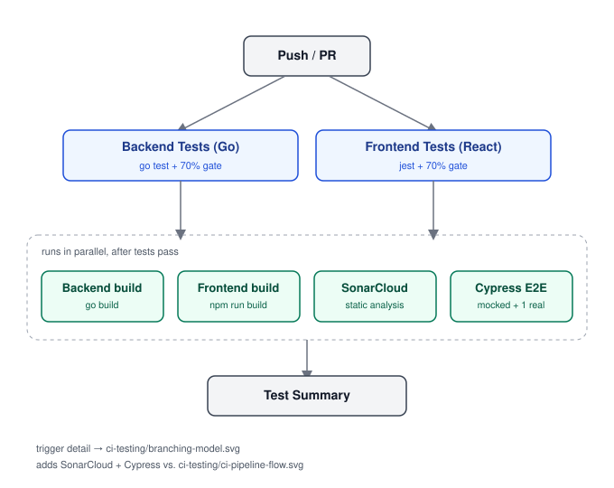

*7 jobs: tests fan out into builds, static analysis, and E2E in parallel,
then converge into one summary that gates the merge — see [`ADR-004`](docs/decisions/ADR-004-pipeline-extension.md).*

Every push to a `feature/**` branch, and every direct push to `staging` or
`main`, runs the same 7-job pipeline — tests, builds, static analysis, and
E2E, converging into one summary job. The branch ruleset requires all 7
individually, not just the summary — see
[`docs/rules/testing-and-quality-gates.md`](docs/rules/testing-and-quality-gates.md)
for why relying on the summary alone wasn't enough.

The trigger rules themselves — `push` scoped to `feature/**`, `pull_request`
scoped to `staging`/`main` — mirror the branching model `ci-testing` already
established; see
[ci-testing's branching diagram](https://github.com/CarpinetiOctavio/forum-app-ci-testing/blob/main/docs/diagrams/branching-model.svg)
rather than repeating it here. This pipeline's addition on top of that shape
is the four extra jobs — coverage gate, SonarCloud, Cypress, and the wider
ruleset — visible by contrast with
[ci-testing's own pipeline diagram](https://github.com/CarpinetiOctavio/forum-app-ci-testing/blob/main/docs/diagrams/ci-pipeline-flow.svg).

`ADR-004` documents a pattern this repo hit three separate times: a gate that
looked like it was protecting something until someone actually checked the
mechanism — a summary job that never depended on real results, a ruleset that
only watched that summary, and a pipeline that never ran at all against the
branches it was supposed to protect. See
[`ADR-004`](docs/decisions/ADR-004-pipeline-extension.md#consequences) for
the full account.

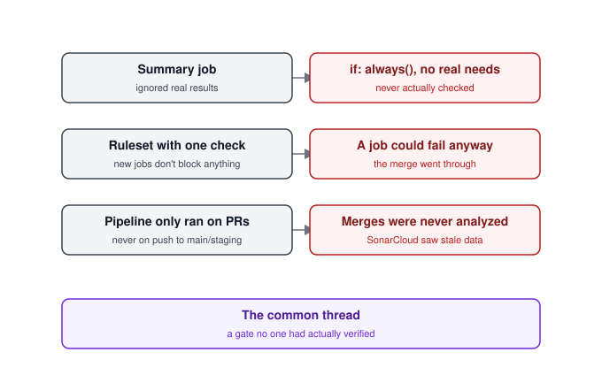

*Three unrelated-looking bugs, one shared root cause: a gate whose actual
mechanism nobody had checked — see [`ADR-004`](docs/decisions/ADR-004-pipeline-extension.md#consequences).*

---

## Testing strategy

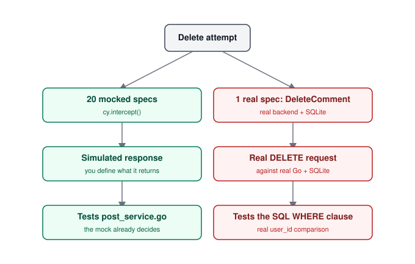

*20 specs run against `cy.intercept()` mocks; `DeleteComment` alone runs
against the real backend, because a mocked test would share the same blind
spot as the unit test it's meant to complement — see [`ADR-003`](docs/decisions/ADR-003-cypress.md).*

Most of this repo's E2E coverage is mocked by design — fast, deterministic,
and sufficient wherever the service layer's own unit tests already exercise
the logic being tested. One flow breaks that rule on purpose:
`DeleteComment`'s authorization check lives in a SQL `WHERE` clause instead
of the service layer, so a mocked Cypress test would share the exact blind
spot as the mocked unit test it's meant to complement. That one flow runs
against the real backend and a real SQLite database instead. See
[`ADR-003`](docs/decisions/ADR-003-cypress.md) for the full reasoning,
including where else in this codebase authorization checks live in the
service layer vs. the database.

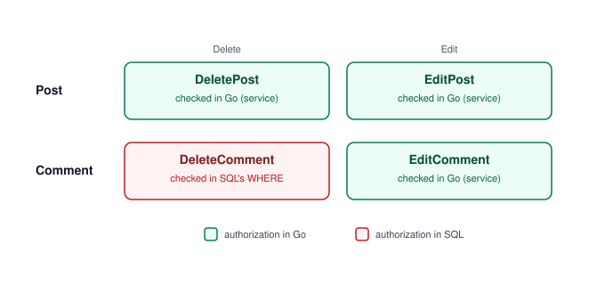

*Three of four methods check authorship in Go; `DeleteComment` alone
delegates that check to the SQL `WHERE` clause instead — see [`ADR-005`](docs/decisions/ADR-005-edit-functionality.md).*

---

## Screenshots

Evidence from the real pipeline and app, not just their configuration.

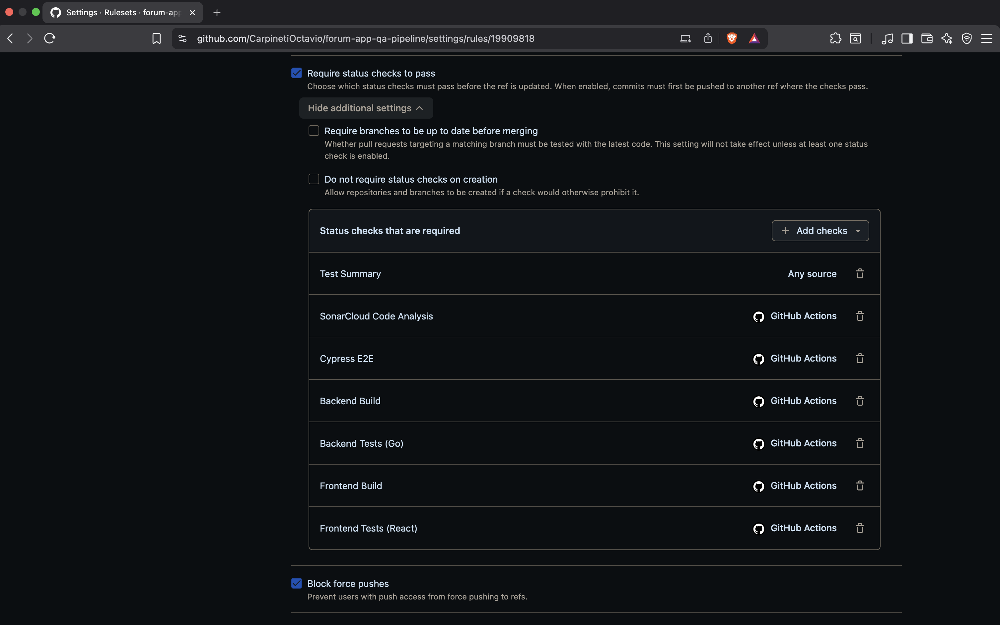

*The ruleset protecting `staging` and `main` — 7 required status checks,
covering each of the 7 pipeline jobs individually rather than relying on
`Test Summary` alone. See
[`docs/rules/testing-and-quality-gates.md`](docs/rules/testing-and-quality-gates.md)
for why.*

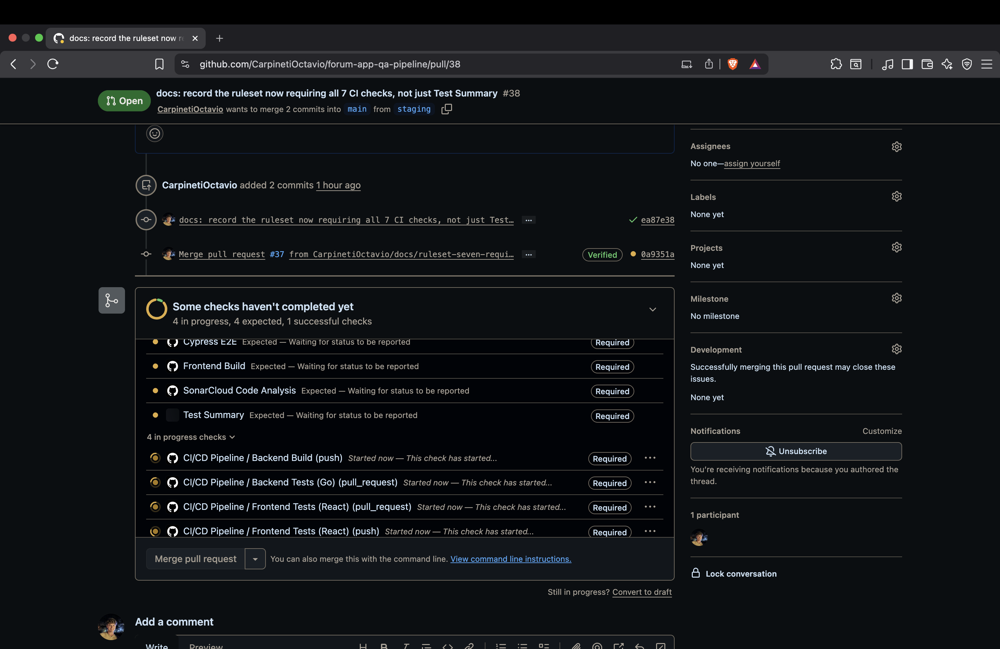

*A pull request against `main`, showing all 7 required checks demanded
before the merge button unlocks.*

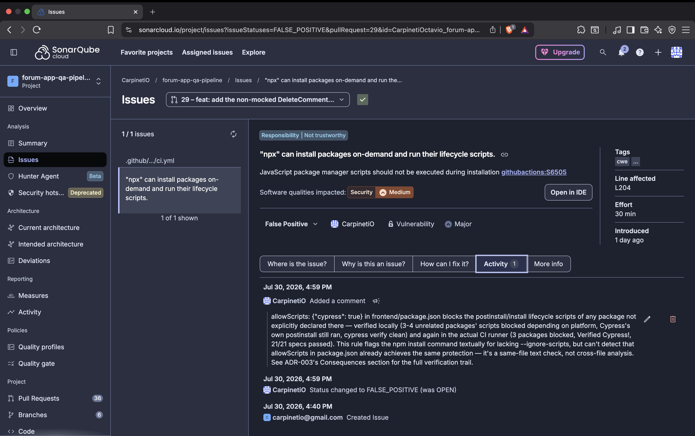

*A `githubactions:S6505` finding resolved as a documented false positive —
`allowScripts` in `package.json` already closes the gap the rule can't see
across files. See [`ADR-003`](docs/decisions/ADR-003-cypress.md#consequences)
for the verification trail.*

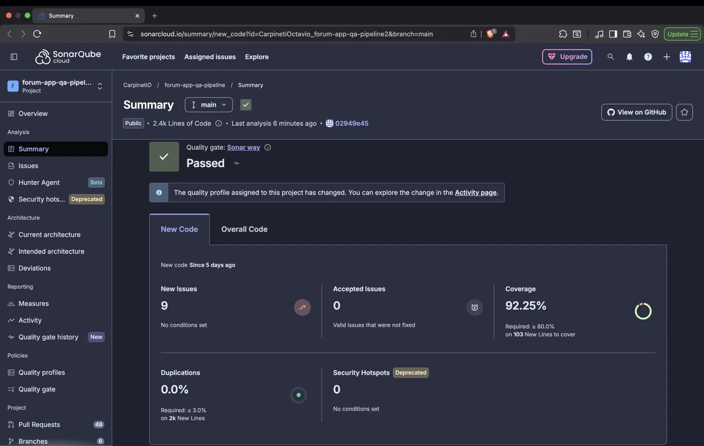

*SonarCloud's Quality Gate passing on `main`, with real Coverage on New Code
— not the placeholder state this project sat in for over a day while a scope
misconfiguration kept SonarCloud from indexing most of the codebase. See
[`ADR-002`](docs/decisions/ADR-002-sonarcloud.md#consequences) for the full
chain of scope bugs behind this number.*

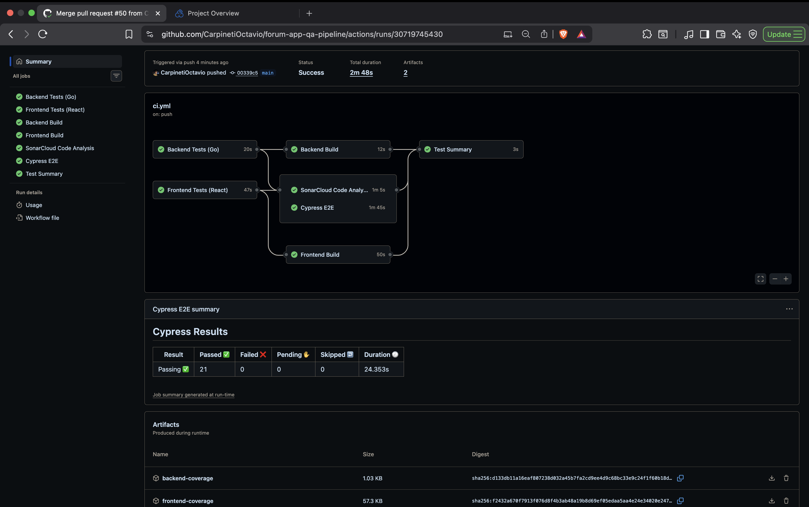

*A full pipeline run against `main` — all 7 jobs passing, `SonarCloud Code
Analysis` and `Cypress E2E` included.*

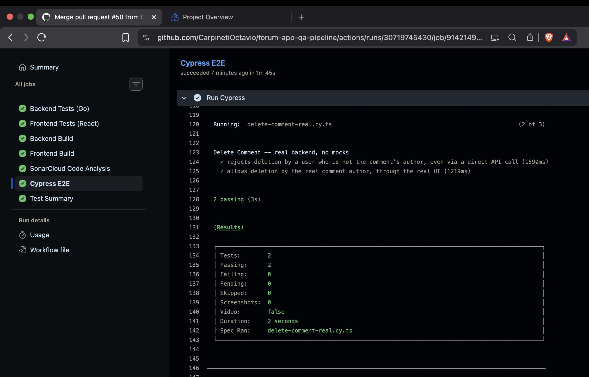

*`delete-comment-real.cy.ts` — the single Cypress spec that runs against the
real backend and a real SQLite database instead of `cy.intercept()`. Both
tests pass: rejecting deletion by a non-author even via a direct API call,
and allowing deletion by the real author through the real UI. See
[`ADR-003`](docs/decisions/ADR-003-cypress.md) for why this one flow breaks
the mocked-by-default rule.*

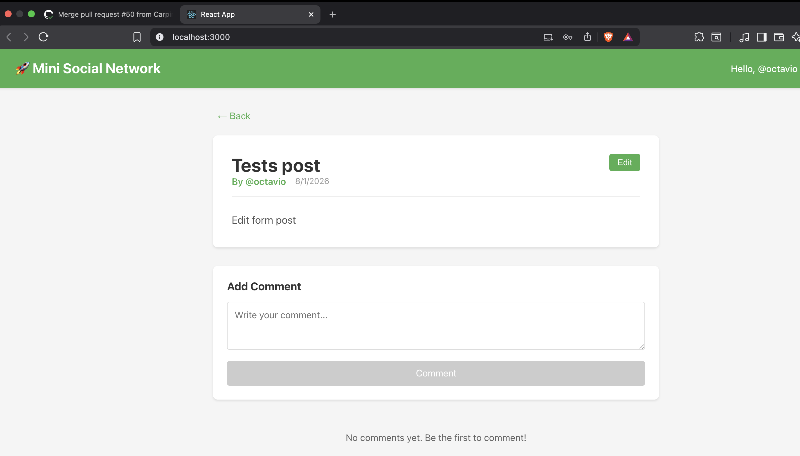

*The Edit button, visible because the logged-in user is the post's author —
a client-side convenience, not the actual authorization boundary. See
[`ADR-005`](docs/decisions/ADR-005-edit-functionality.md) for where the real
check lives.*

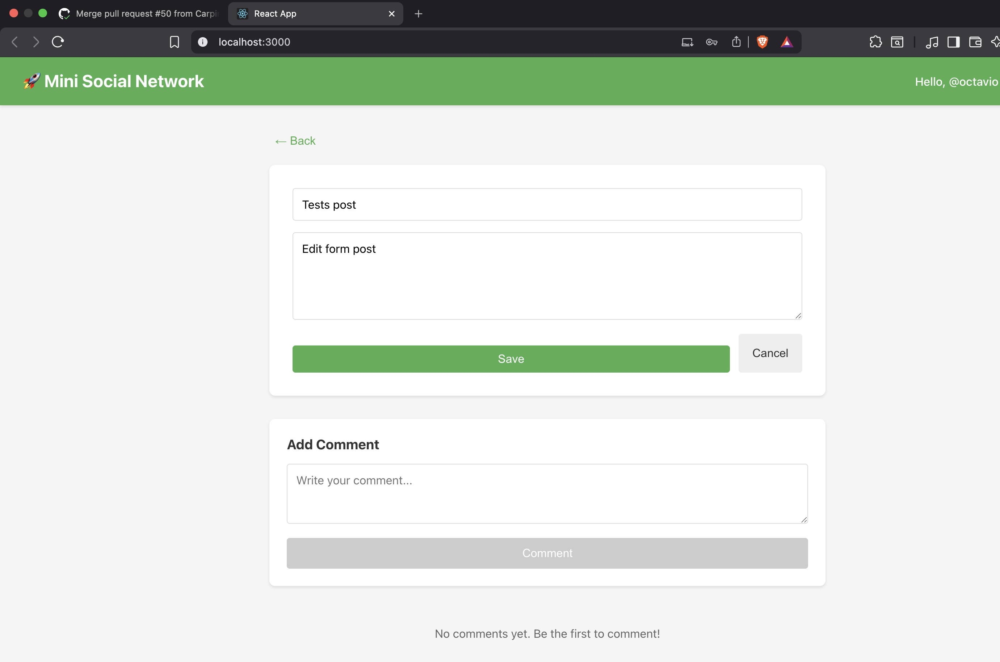

*The edit form, pre-filled with the post's current title and content.*

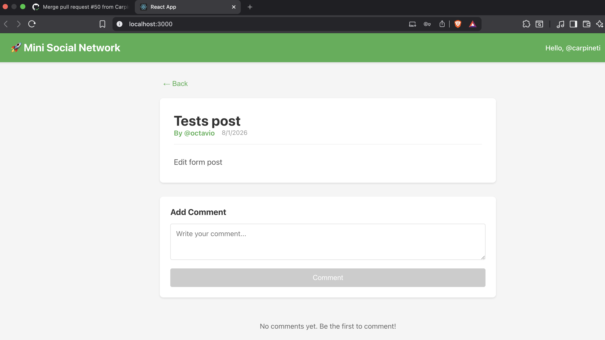

*Same post, logged in as a different user — no Edit button. The real 403 for
this exact scenario is already exercised end-to-end by the Cypress spec
above, so this is the UI-side complement, not a separate proof of the same
authorization check.*

---

## Tech Stack

| Layer | Technology |
|-------|------------|
| Backend | Go 1.24 + SQLite |
| Frontend | React 18 + TypeScript |
| Unit testing | Go testing + Jest |
| E2E testing | Cypress (mocked + 1 real) |
| Static analysis | SonarCloud |
| CI/CD | GitHub Actions, Node 24 |

Node is on 24, not the 18 inherited from `ci-testing` — Cypress 13+ requires
20+, and 24 is the current active LTS rather than a version already past
end-of-life. `ci-testing` stays on 18 for its own scope, which has no Cypress
dependency; see [`ADR-003-cypress.md`](docs/decisions/ADR-003-cypress.md#consequences)
for this repo's own reasoning.

---

## Getting Started

See [`docs/SETUP.md`](docs/SETUP.md) for infrastructure setup and
[`docs/COMMANDS.md`](docs/COMMANDS.md) for the commands that work against this
repo's current state.

---

## Documentation

- `docs/decisions/` — ADRs for decisions made in this repo. Decisions this repo
  builds on from `ci-testing` are linked, not duplicated (see
  `docs/rules/documentation.md`).
- `docs/rules/` — operating rules for anyone (human or AI) working in this repo.
- `docs/audits/` — audit reports that informed decisions recorded in this
  repo's ADRs, kept as evidence, not summarized away.
- `docs/diagrams/` — pipeline shape and testing-strategy diagrams referenced
  from the relevant ADRs.
- `docs/screenshots/` — evidence from the real pipeline and app, not just
  their configuration.

---

## AI Usage Disclosure

Claude acted as a conceptual auditor and writing assistant during this
repository's setup — never as decision-maker for scope, testing strategy, or
what to carry forward from `forum-app-qa-pipeline-legacy`. All design decisions
were made by Octavio Carpineti; Claude's role was surfacing inconsistencies,
verifying claims against the actual repository and its predecessors, and
drafting documentation for review. See `CLAUDE.md` for the operating rules that
govern this.